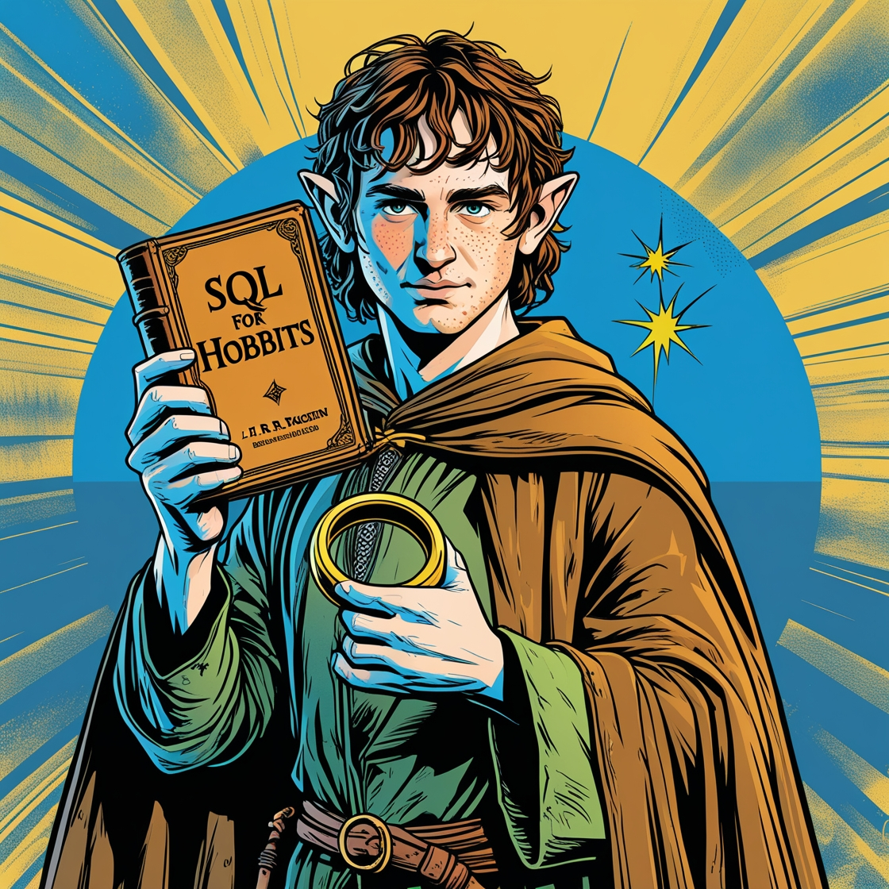

# Podcast O Senhor dos Dados: A Jornada SQL

Um podcast criado com auxilio de Inteligencia Artificial, onde exploraremos o incrível incrível universo da linguagem SQL de uma maneira leve, divertida e simples para quem está apenas começando. 

🎙️ [Clique aqui para ouvir o Podcast](https://audiomack.com/anagalli/song/menos-baguna-mais-paz-ep1-iniciando-sua-jornada-minimalista)

# 💻 Tecnologias utilizadas no projeto
- [ChatGPT](https://chatgpt.com/) para geração de conteúdo
- [Leonardo AI](https://app.leonardo.ai/)) para geração da imagem de capa.
- [ElevenLabs](https://elevenlabs.io/app/home) para Text-To-Speech
- [CapCut](https://www.capcut.com/pt-br/) para edição

# 🧠 Prompts utilizados

**ChatGPT**
| Ação | Promtp |
|------|--------|
|Criar Título do Podcast| Você é um roteirista de podcast e vamos criar um podcast de tecnologia, focado em Linguagem de Programação e eu gostaria de uma ajuda para criar 5 sugestões de nomes criativos para um podcast de programação nerd e que tenha algum trocadilho nerd no título. O podcast vai falar sobre dicas para iniciantes em programação SQL. {REGRAS} > o nome deve ser enxuto, um nome e um subtítulo >o nome tenha algum trocadilho nerd com nomes de franquias conhecidas como Star Wars, Vingadores ou Senhor dos Anéis >o nome deve conter alguma palavra forte que remete a SQL. {REGRAS NEGATIVAS} >não quero que o nome tenha palavras em inglês |
|Criar Roteiro do Podcast|Você é um roteirista de podcast e vamos criar um podcast de tecnologia, focado em Linguagem de Programação cujo nome é "O Senhor dos Dados: A Jornada SQL", com público alvo de iniciantes em Programação SQL.O formato do roteiro deve ser:[INTRODUÇÃO] [CURIOSIDADE 1] [CURIOSIDADE 2] [FINALIZAÇÃO] {REGRAS}> No bloco [INTRODUÇÃO] substitua por introdução iguais aos vídeos do canal "garotas geeks", como se fossem escritos pela Flávia Gasi > no bloco [CURIOSIDADE 1] substitua por uma dica que você daria para quem está começando a aprender SQL > no bloco [CURIOSIDADE 2] substitua por uma explicação de como a prática ajuda a melhorar no aprendizado de SQL > no bloco [FINALIZAÇÃO] substitua por uma despedida cool com o final "Eu sou Keylla e esse foi a jornada dessa semana" > use termos claros e simples > O podcast será apresentado somente por uma pessoa, chamada Keylla > O podcast deve ser curto. {REGRAS NEGATIVAS}> não use muito termos técnicos > não ultrapasse 3 minutos de duração|

**Leonardo.AI**
| Ação | Prompt |
|------|--------|
| Criar capa | Frodo from The Lord of the Rings holding a book about SQL in one hand and the ring of power in the other|

## 👨‍💻 Autoria

Keylla Lopes  
[GitHub](https://github.com/keylopes) 

---

⌨️ com 💜 por [Keylla Lopes](https://github.com/keylopes)
